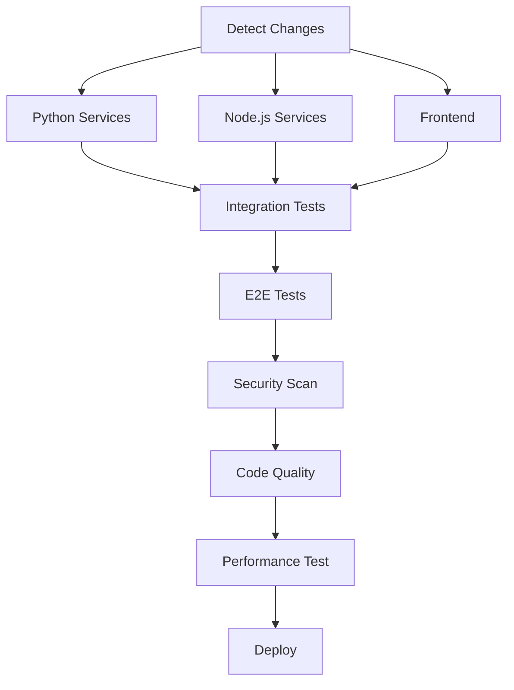

# Claude Code Monorepo Testing Strategy

This document outlines the comprehensive testing strategy for the Claude Code Monorepo system, following the coding guide principles T-1 through T-5.

## Table of Contents

- [Overview](#overview)
- [Testing Principles](#testing-principles)
- [Test Types](#test-types)
- [Service-Specific Testing](#service-specific-testing)
- [Running Tests](#running-tests)
- [CI/CD Integration](#cicd-integration)
- [Quality Gates](#quality-gates)
- [Coverage Requirements](#coverage-requirements)
- [Contributing](#contributing)

## Overview

The Claude Code Monorepo implements a multi-layered testing strategy designed to ensure code quality, reliability, and maintainability across all services. Our testing approach follows industry best practices and emphasizes:

- **T-1 (MUST)**: Colocated unit tests in `.spec.ts` files
- **T-2 (MUST)**: Integration tests for API changes  
- **T-3 (MUST)**: Separation of pure-logic unit tests from DB-touching integration tests
- **T-4 (SHOULD)**: Preference for integration tests over heavy mocking
- **T-5 (SHOULD)**: Thorough unit testing of complex algorithms

## Testing Principles

### Core Principles

1. **Test-Driven Development (TDD)**: Follow the scaffold stub → write failing test → implement cycle
2. **Separation of Concerns**: Clearly separate unit tests from integration tests
3. **Evidence-Based Testing**: All tests must be able to fail for real defects
4. **Comprehensive Coverage**: Maintain high test coverage with meaningful tests
5. **Fast Feedback**: Unit tests should run quickly to enable rapid development

### Testing Pyramid

```
    /\
   /E2E\        - End-to-End Tests (Few, High Value)
  /____\
 /      \
/Integration\   - Integration Tests (Some, Critical Paths)
\________/
\              \
 \  Unit Tests  \  - Unit Tests (Many, Fast, Focused)
  \______________\
```

## Test Types

### Unit Tests

**Location**: Colocated with source files as `.spec.ts` or `.spec.js`
**Purpose**: Test individual functions and components in isolation
**Characteristics**:
- Fast execution (< 1ms per test)
- No external dependencies
- High coverage of edge cases
- Mock external dependencies

**Example Structure**:
```
src/
├── components/
│   ├── Button.jsx
│   └── Button.spec.jsx          # T-1: Colocated unit test
├── utils/
│   ├── helpers.js
│   └── helpers.spec.js          # T-1: Colocated unit test
```

### Integration Tests

**Location**: `tests/integration/` directories
**Purpose**: Test component interactions and external dependencies
**Characteristics**:
- Test database operations
- Test API endpoints
- Test service communication
- Use real dependencies where possible

**Example Structure**:
```
services/claudecodeui-backend/
├── tests/
│   └── integration/
│       ├── api-routes.test.js   # T-2: API integration tests
│       ├── database.test.js     # T-3: DB integration tests
│       └── auth.test.js
```

### End-to-End (E2E) Tests

**Location**: `services/e2e-tests/`
**Purpose**: Test complete user workflows
**Characteristics**:
- Use Playwright for browser automation
- Test across multiple browsers
- Validate complete user journeys
- Include accessibility testing

**Example Structure**:
```
services/e2e-tests/
├── tests/
│   ├── user-authentication.spec.js
│   ├── claude-code-workflow.spec.js
│   └── project-management.spec.js
```

## Service-Specific Testing

### Python Services

**Framework**: pytest with pytest-cov, pytest-asyncio, pytest-mock
**Configuration**: `pytest.ini` and `conftest.py`
**Coverage Tool**: coverage.py

**Services**:
- SuperClaude Framework
- Memory Service  
- Unified Query Service
- Cognee
- Memos

**Example Test Command**:
```bash
cd services/superclaude-framework
python -m pytest tests/ -v --cov --cov-report=html
```

### Node.js Services

**Framework**: Jest with supertest for API testing
**Configuration**: `jest.config.js`
**Coverage Tool**: Built-in Jest coverage

**Services**:
- CLI Tool
- ClaudeCodeUI Backend
- Agent-IO
- Memento MCP

**Example Test Command**:
```bash
cd services/claudecodeui-backend
npm test
```

### React Frontend

**Framework**: Vitest with React Testing Library
**Configuration**: `vitest.config.js`
**Coverage Tool**: V8 coverage provider

**Services**:
- ClaudeCodeUI Frontend

**Example Test Command**:
```bash
cd services/claudecodeui-frontend
npm run test:run
```

## Running Tests

### Quick Start

Use the test runner script for comprehensive testing:

```bash
# Run all unit and integration tests
./scripts/test-runner.sh

# Run only unit tests
./scripts/test-runner.sh --unit-only

# Run tests for specific services
./scripts/test-runner.sh -s "frontend,backend"

# Run all tests including E2E
./scripts/test-runner.sh --e2e

# Run tests with coverage
./scripts/test-runner.sh --coverage
```

### Manual Testing

#### Python Services
```bash
cd services/[service-name]
pip install -r requirements.txt
pip install pytest pytest-cov pytest-asyncio pytest-mock
python -m pytest tests/ -v --cov
```

#### Node.js Services
```bash
cd services/[service-name]
npm ci
npm test
```

#### React Frontend
```bash
cd services/claudecodeui-frontend
npm ci
npm run test:run
```

#### E2E Tests
```bash
cd services/e2e-tests
npm ci
npx playwright install --with-deps
npm test
```

### Test Options

| Option | Description |
|--------|-------------|
| `--unit-only` | Run only unit tests |
| `--integration` | Run only integration tests |
| `--e2e` | Include end-to-end tests |
| `--coverage` | Generate coverage reports |
| `--verbose` | Verbose output |
| `--parallel` | Run tests in parallel (default) |
| `--sequential` | Run tests sequentially |
| `--fail-fast` | Stop on first failure |
| `--clean` | Clean test artifacts before running |

## CI/CD Integration

### GitHub Actions Pipeline

The project includes a comprehensive CI/CD pipeline (`.github/workflows/test-pipeline.yml`) that:

1. **Detects Changes**: Uses path filters to run only relevant tests
2. **Matrix Testing**: Tests across multiple service types in parallel
3. **Quality Gates**: Enforces coverage thresholds and code quality
4. **Security Scanning**: Runs vulnerability scans on all dependencies
5. **Performance Testing**: Lighthouse CI for frontend performance
6. **Cross-Browser Testing**: E2E tests across Chrome, Firefox, Safari

### Pipeline Stages



## Quality Gates

### Coverage Requirements

| Service Type | Minimum Coverage |
|--------------|------------------|
| Python Services | 80% (branches, functions, lines, statements) |
| Node.js Services | 75% (branches, functions, lines, statements) |
| React Frontend | 70% (branches, functions, lines, statements) |
| Critical Routes | 80% (API endpoints, auth middleware) |

### Code Quality Metrics

- **Cyclomatic Complexity**: Max 10 per function
- **Test Coverage**: See table above
- **Security**: No high/critical vulnerabilities
- **Performance**: Lighthouse score > 90
- **Accessibility**: WCAG 2.1 AA compliance

### Validation Checklist

Before marking any test as complete, ensure:

- [ ] Tests can fail for real defects (T-2)
- [ ] Unit tests are colocated with source (T-1)
- [ ] Integration tests are separated from unit tests (T-3)
- [ ] Complex algorithms have thorough unit tests (T-5)
- [ ] Integration tests cover API changes (T-2)
- [ ] Coverage thresholds are met
- [ ] All tests pass in CI environment

## Coverage Requirements

### Global Standards

Based on coding guide principles and industry best practices:

- **Unit Test Coverage**: ≥80% for pure logic functions
- **Integration Test Coverage**: ≥75% for critical paths
- **E2E Test Coverage**: 100% of critical user workflows
- **API Test Coverage**: 100% of public endpoints

### Service-Specific Requirements

#### Python Services
```python
# pytest.ini configuration
[coverage:run]
source = .
omit = */tests/*, */venv/*, setup.py

[coverage:report]
exclude_lines =
    pragma: no cover
    def __repr__
    raise AssertionError
    raise NotImplementedError

# Minimum thresholds
fail_under = 80
```

#### Node.js Services
```javascript
// jest.config.js
coverageThreshold: {
  global: {
    branches: 75,
    functions: 75,
    lines: 75,
    statements: 75
  }
}
```

#### React Frontend
```javascript
// vitest.config.js
coverage: {
  thresholds: {
    global: {
      branches: 70,
      functions: 70,
      lines: 70,
      statements: 70
    }
  }
}
```

## Best Practices

### Writing Effective Tests

1. **Follow AAA Pattern**: Arrange, Act, Assert
2. **One Assertion Per Test**: Focus on single behavior
3. **Meaningful Test Names**: Describe what is being tested
4. **Test Edge Cases**: Boundary conditions, error states
5. **Use Property-Based Testing**: For complex algorithms (T-5)

### Test Organization

```javascript
describe('ComponentName', () => {
  describe('when in default state', () => {
    it('should render correctly', () => {
      // Test implementation
    });
  });
  
  describe('when user interacts', () => {
    it('should handle click events', () => {
      // Test implementation
    });
  });
});
```

### Mocking Guidelines

- **Mock External Dependencies**: APIs, databases, file systems
- **Don't Mock Internal Logic**: Test real implementations
- **Use Minimal Mocks**: Only mock what's necessary
- **Verify Mock Interactions**: Ensure mocks are called correctly

## Contributing

### Before Submitting Tests

1. Run tests locally: `./scripts/test-runner.sh`
2. Check coverage: `./scripts/test-runner.sh --coverage`
3. Run linting: Service-specific lint commands
4. Test across browsers: `./scripts/test-runner.sh --e2e`

### Test Review Checklist

- [ ] Tests follow T-1 to T-5 principles
- [ ] Appropriate test type (unit/integration/e2e)
- [ ] Good test coverage of new code
- [ ] Tests are deterministic and reliable
- [ ] Meaningful test descriptions
- [ ] Proper mocking strategy
- [ ] Tests run in CI environment

## Troubleshooting

### Common Issues

**Tests timing out**:
- Increase timeout in test configuration
- Check for unresolved promises
- Verify mock implementations

**Coverage not met**:
- Add tests for uncovered branches
- Remove dead code
- Improve test assertions

**E2E tests flaky**:
- Add proper wait conditions
- Use data-testid selectors
- Increase timeout for async operations

**Integration tests failing**:
- Check database setup
- Verify API endpoints
- Ensure proper test isolation

### Getting Help

- Check existing tests for patterns
- Review coding guide principles
- Run tests with `--verbose` flag
- Check CI logs for detailed errors

## Resources

- [Jest Documentation](https://jestjs.io/docs/getting-started)
- [Vitest Documentation](https://vitest.dev/)
- [Playwright Documentation](https://playwright.dev/)
- [pytest Documentation](https://docs.pytest.org/)
- [React Testing Library](https://testing-library.com/docs/react-testing-library/intro)
- [Testing Best Practices](https://github.com/goldbergyoni/javascript-testing-best-practices)